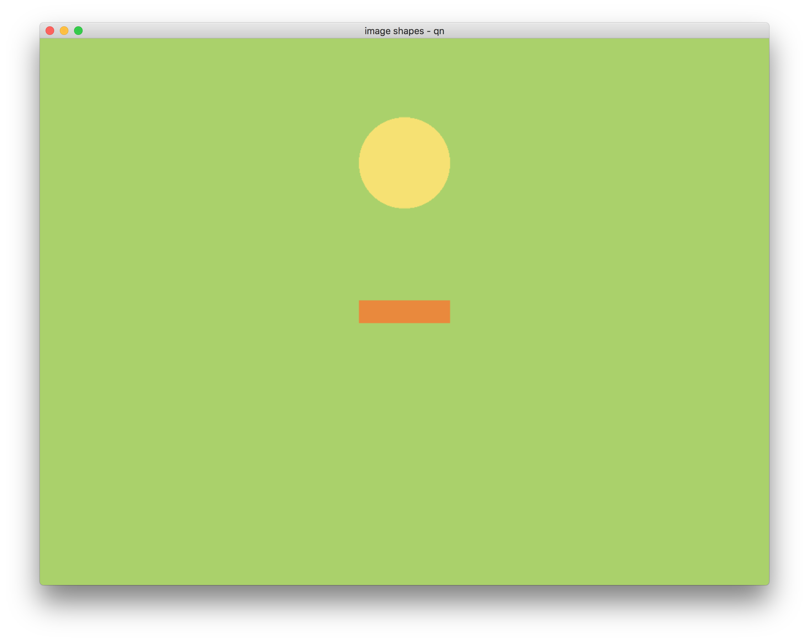
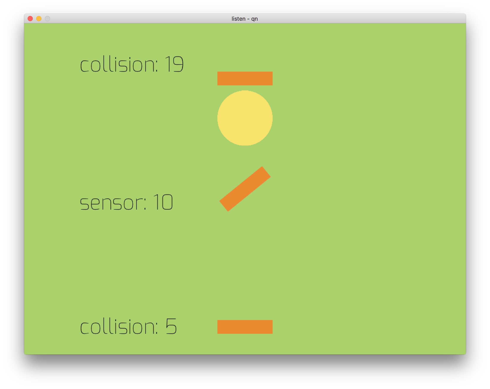
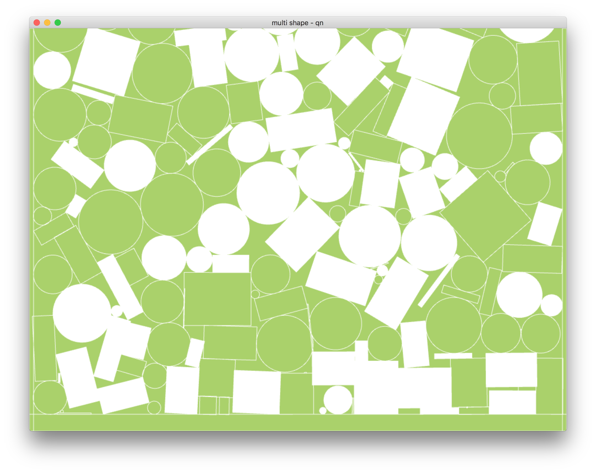
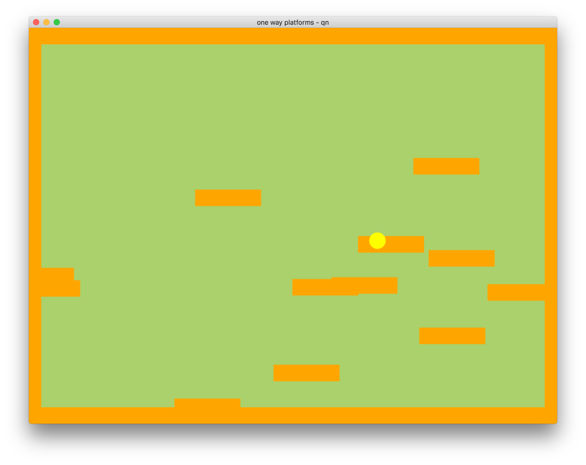

# qn

pronounced 'queen', but actually stands for 'quick nape'

a simple wrapper to use the awesome [nape](http://napephys.com) physics with [kha](http://kha.tech). 

currently in super beta & needs tons of work for everything else. but its meant to make things just a wee bit simpler to get things up & running

# install
simply open up terminal/command line & type [or just copy this next bit of code]
	
	haxelib git qn https://github.com/lewislepton/qn.git

# how to use
in your kha projects `khafile.js` - put in this
	
	project.addLibrary('qn');

also check out the given example[s]

# todo
- [X] work further on world class further & make it cut out using space in the project 
- [ ] work on bouncing stuff 
- [ ] extend things further 
- [ ] make more examples 
- [ ] able to change rotation point. so far its only in the middle 
- [ ] many more things... but cant think right now ;)

# examples

